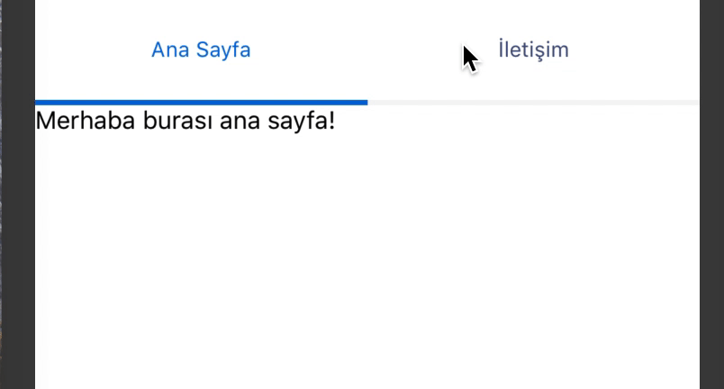

<p align="center">
    
</p>

<p align="center">
A Tab View component for React Native.
</p>

### Installation
Open a Terminal in the project root and run:

    yarn add @tatil/react-native-tabs
    
### Quick Start

Basic usage look like this:

```JS
import React, { Component } from 'react';

class Index extends Component {
  render() {
    return (
       <RnativeTabs>
         <View label="Ana Sayfa">
           <Text>Merhaba burası ana sayfa!</Text>
         </View>

         <View label="İletişim">
           <Text>Merhaba burası İletişim!</Text>
         </View>
       </RnativeTabs>   
    )
  }
}
```
